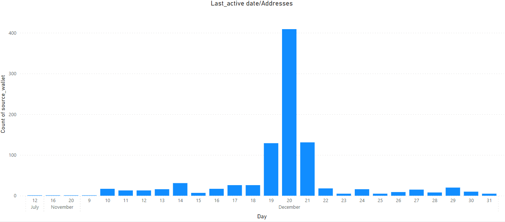

Currated data and analysis note books are avaliable on ocean : https://market.oceanprotocol.com/asset/did:op:3a5f6705369b2a461753d292519fcf76d17bb5360cef9ef4b414f1397ebe2332
Legos: https://github.com/G-r-ay/Anti-Sybil-Legos


# **EDA on Sybil Patterns and their effect on the Fantom and Unicef round**

*The findings of a preliminary examination denote the traits and actions of sybils on grant rounds and are presented in this markdown. My objective was to find patterns, oddities, and trends in the data that would shed light on the intentions and strategies of these "web3 actors."*

*Despite the fact that each grant round was distinctive, they all had one thing in common: Sybil attacks*


## **Indicators and Analysis Methodology**
Sybils are easily identifiable by repeated patterns such as low transaction volume, lack of blockchain activity, inactivity soon after financing, and same blockchain activity and history.

This study was carried out to show the recurrent nature of sybils and their relationship to targeted projetcs. The information utilized comprises the current balance, transaction count, number of active days, initial transaction amount, last recipient address, and first and last transacting days. Kmeans Clustering and the self-created Spearmanr Lego were used to analyse and classify the data.
___


___
### *The statistical information for each round is shown below:*

### [Fantom Round](#fantom-round)
### [UNICEF Round](#unicef-round-1)

___

___
## **UNICEF Round**
*The UNICEF round was analyzed for possible sybils by looking for voting trends, correlations between votes and grants, and anomalies indicating the presence of sybils. Concerns were expressed after a dramatic increase in votes on December 20, which might suggest a sybil attack or a successful voter mobilization attempt.*

___
<table style="width:100%">
  <tr>
    <td><br><p align="center">Daily Vote Count Bar Plot</p></td>
    <td><br><p align="center">First Activity per Address Bar Plot</p></td>
  </tr>
  <tr>
    <td><br><p align="center">Days of Active Usage per Address</p></td>
    <td><br><p align="center">Last Active Date per Address Bar Plot</p></td>
  </tr>
</table>

A significant increase in the number of votes cast in the Unicef voting rounds on December 20th has sparked fears of a sybil attack. A sybil attack occurs when a large number of bogus identities are created in order to tamper with the results of an online voting system. A thorough investigation was conducted to look for any trends or abnormalities that would suggest the existence of sybils in order to determine the cause of the spike in votes.

A large number of accounts with first and last active dates on the same day, a sudden increase in votes cast, and instances of low general activity on wallets that funded on that day all point to a sybil attack, according to the investigation.

Furthermore, most wallets' final transactions were directed to a "round wallet," indicating a lack of activity.

The KMeans algorithm was used in the investigation to cluster wallets with similar patterns, and the datapoints were statistically analyzed. Conor GTC Eth, Gnosis Safe, Bridges, Zksync, and Artitrum Nitro contracts accounted for the majority of the top nine most recent transactions, according to the results. Fifty percent of these wallets had fewer than 33 transactions and less than 15 days of activity, with the majority having 3 to 22 transactions.

In conclusion, the investigation's findings support the theory that the spike in votes on December 20th was caused by a sybil attack.

___
## **Fantom Round**
*The investigation discovered parallels between the Unicef and Fantom rounds, both of which showed an unusual increase in votes at specific times. Both rounds had similar funding patterns, with only minor differences, and saw a high volume of voting on December 20th, 2022 and the final day of the round on January 1st, 2023. These parallels cast doubt on the validity of the voting results in both rounds and raise the prospect of coordinated sybil attacks.*

<table style="width:100%">
  <tr>
    <td><br><p align="center">Daily Vote Count Bar Plot</p></td>
    <td><br><p align="center">First Activity per Address Bar Plot</p></td>
  </tr>
  <tr>
    <td><br><p align="center">Days of Active Usage per Address</p></td>
    <td><br><p align="center">Last Active Date per Address Bar Plot</p></td>
  </tr>
</table>

The repetition of a similar trend in two rounds, with a dramatic surge in votes on December 20th, shows possible suspect behavior. However, it is vital to mind the Fantom chain's limited popularity in comparison to other chains like as Ethereum and Polygon. The minimal wallet activity on the Fantom chain might simply be due to users using their wallets for funding and having little motivation to participate with the chain itself. Because of this low participation, malevolent actors known as sybils can appear as non-Fantom chain users and carry out their actions unnoticed. In such settings, the likelihood of sybil activity cannot be ruled out and warrants further examination.

The fantom round votes were almost inseperable through just the information gotten from on chain data but the clsutering algorithm ws able to cluster properly on basis on the funding amount, current_balance, Number of active days and initial balance. resulting a total sybil count of 804
___

##   *Summary of findings*
*The time and share volume are too accurate to be viewed as chance; it is obvious that patterns exist across multiple addresses and that they are not merely attributable to non-web3 natives.*

*Unicef voting rounds on December 20 saw an unusually high number of votes cast, which sparked a detailed inquiry to establish whether a sybil attack had occurred. To examine patterns and irregularities in the voting behavior, the research used the KMeans method. According to the clustering and statistical analysis, the majority of the top nine most recent transactions were made to contracts which are, A contract made by Conor GTC Eth, Gnosis Safe, Bridges, Zksync, and Artitrum Nitro. These addresses were known for their low levels of activity,The unicef round has 467 sybils and a mean transaction count and number of active days of 4 and 2, respectively, with the most active sybil date being the 20th of December 2023, and the fantom has 803 sybils and a mean transaction count of 31.87, with the most active date being the 1st of January 2023s.The "round wallet" was the target of the most frequent final transaction made by wallets, which was perceived as a sign of inactivity. Additionally, by using the "[Correlation Lego](#correlation-lego)" and human inspection,the data's correlated nature may be further examined.Although the Clustering algorithm my not be 100% accurate it focus with tje help of human inspection was to reduce false negatives*


The sybil pattern identified from the analysis and data collection described above consists of:

- A low transaction count
- Low activity days
- A strong correlation with the activity of other addresses
- A short time between the first and last transaction
- Address inactivity immediately after funding


*Addresses identified by the K-means algorithm as Sybils and displaying stronger Sybil behavior through human review all met the majority of the criteria are listed in the Sybil.txt file.*

<br>

<br>

---


# Legos Created from Analysis:

## Correlation Lego
The "address correlation Lego" is a pattern-identification Lego that is intended to be used against previously known sybil patterns that will be stored in a readable format (currently using a pandas dataframe),Sybil tactis change each time but the unable to hide their on chain correlations. Its purpose is to judge the correlation between the activities of an address and those of sybil addresses using the [Spearman's rank correlation coefficient](https://en.wikipedia.org/wiki/Spearman%27s_rank_correlation_coefficient).

$$r_s = \frac{\text{cov}(R_X, R_Y)}{\sigma_{R_X} \sigma_{R_Y}}$$

Where $R_{X}$, $R_{Y}$ are the ranked variables and $\text{cov}$, $\sigma$ represent the covariance and standard deviation respectively.

### **Lego Walk-through:**


In order to obtain the following information, this Lego uses the Pokt enpoint to count the number of transactions, the balance, and the Covalent Transaction API to query the following :


<table border="1">
  <tr>
    <th>Variable Name</th>
    <th>Description</th>
  </tr>
  <tr>
    <td>Number of active days</td>
    <td>Number of days account was active</td>
  </tr>
  <tr>
    <td>Initial amount received</td>
    <td>Initial amount received by the account</td>
  </tr>
  <tr>
    <td>First active day</td>
    <td>Day of the first transaction</td>
  </tr>
  <tr>
    <td>First active month</td>
    <td>Month of the first transaction</td>
  </tr>
  <tr>
    <td>First active year</td>
    <td>Year of the first transaction</td>
  </tr>
  <tr>
    <td>Last active day</td>
    <td>Day of the last transaction</td>
  </tr>
  <tr>
    <td>Last active month</td>
    <td>Month of the last transaction</td>
  </tr>
  <tr>
    <td>Last active year</td>
    <td>Year of the last transaction</td>
  </tr>
  <tr>
    <td>Transaction count</td>
    <td>Number of transactions made by the account</td>
  </tr>
</table>

    Code Refernece

```python 
    def get_txn_count(address):
        pokt_Eth_endpoint = "https://eth-mainnet.gateway.pokt.network/v1/lb/78cad988d47e553027481226"
        headers = {'content-type': 'application/json'}

        payload = {
            "method": "eth_getTransactionCount",
            "params": [address, "latest"],
            "jsonrpc": "2.0",
            "id": 1,
        }
        response = requests.post(pokt_Eth_endpoint, data=json.dumps(payload), headers=headers).json()
        transaction_count = int(response['result'], 16)
        return transaction_count
    
    def get_transactions_and_date_info(address):
        dates = []
        api_key = "api-key"
        transaction_dates = []
        url = f"https://api.covalenthq.com/v1/1/address/{address}/transactions_v2/?no-logs=True"
        
        headers = {
            "x-api-key": covalent_api_key
        }
    
        response = session.get(url, headers=headers)
        txn_data = response.json()['data']['items']
        txn_count = get_txn_count(address)
        for index in range(len(txn_data)):
            dates.append(txn_data[index]['block_signed_at'])

        dates = [*set(dates)]

        first_active_day =  int(re.sub('-','',re.search(r"\d{4}-\d{2}-(\d{2})",txn_data[-1]['block_signed_at']).group(1)))

        first_active_month =  int(re.sub('-','',re.search(r"\d{4}-(\d{2})-\d{2}",txn_data[-1]['block_signed_at']).group(1)))

        first_active_year =  int(re.sub('-','',re.search(r"(\d{4})-\d{2}-\d{2}",txn_data[-1]['block_signed_at']).group(1)))

        last_active_day = int(re.sub('-','',re.search(r"\d{4}-\d{2}-(\d{2})",txn_data[0]['block_signed_at']).group(1)))

        last_active_month = int(re.sub('-','',re.search(r"\d{4}-(\d{2})-\d{2}",txn_data[0]['block_signed_at']).group(1)))

        last_active_year = int(re.sub('-','',re.search(r"(\d{4})-\d{2}-\d{2}",txn_data[0]['block_signed_at']).group(1)))

        inital_ammount_recieved = int(txn_data[-1]['value'])/10**18
        return len(dates),inital_ammount_recieved,first_active_day,first_active_month,first_active_year,last_active_day,last_active_month,last_active_year,txn_count

    def get_balance(address):
        pokt_Eth_endpoint = "https://eth-mainnet.gateway.pokt.network/v1/lb/78cad988d47e553027481226"
        headers = {'content-type': 'application/json'}

        payload = {
            "method": "eth_getBalance",
            "params": [address, "latest"],
            "jsonrpc": "2.0",
            "id": 1,
        }
        response = requests.post(pokt_Eth_endpoint, data=json.dumps(payload), headers=headers).json()
        balance = int(response['result'], 16)
        balance_in_eth = balance/10**18
        return balance_in_eth
```


Following the creation of a data frame to hold the information searched, just using the numerical data is chosen, and the first row of the data frame is then chosen.


```python

    No_days_active,inital_ammount_recieved,first_active_day,first_active_month,first_active_year,last_active_day,last_active_month,last_active_year,txn_count = get_transactions_and_date_info(address)
        balance =get_balance(address)
        pseudo_dataframe.append(address)
        pseudo_dataframe.append(txn_count)
        pseudo_dataframe.append(No_days_active)
        pseudo_dataframe.append(inital_ammount_recieved)
        pseudo_dataframe.append(balance)
        pseudo_dataframe.append(first_active_day)
        pseudo_dataframe.append(first_active_month)
        pseudo_dataframe.append(first_active_year)
        pseudo_dataframe.append(last_active_day)
        pseudo_dataframe.append(last_active_month)
        pseudo_dataframe.append(last_active_year)
        data.loc[len(data.index)] = pseudo_dataframe

        numeric_cols = data.select_dtypes(include=['float64', 'int64']).columns
        single_row = data[numeric_cols].iloc[0]
        print(single_row)

```

This code is determining whether the two dataframes sample sybil data and another dataframe with a single row are correlated. The code calculates the Spearman correlation between the current row and the single row from the other dataframe for each row as it iterates through each row of the sample Sybil data dataframe. A list named "correlations" is then updated with the correlation value. The code establishes a threshold value of 0.6 after the for loop.
The correlations list is then filtered to only contain values larger than the threshold, and the filtered values are then added to a new list named "filtered correlations."

The method returns False if the filtered correlations list is empty. The function returns True if the mean of the filtered correlations list is greater than the threshold and less than or equal to 1.0; otherwise, it returns False.


``` python
for i, row in sample_sybil_data.iterrows():
    # calculate correlation between single row and current row in second dataframe
    correlation = spearmanr(single_row, row)[0]
    # append correlation value to list
    correlations.append(correlation)

# set threshold value
threshold = 0.6


filtered_correlations = [x for x in correlations if x > threshold]
if len(filtered_correlations) == 0:
    return False
else:
    # calculate mean of filtered correlations
    mean_correlation = sum(filtered_correlations) / len(filtered_correlations)
if threshold < mean_correlation <= 1.0:
    return True
else:
    return False


```

## **On-chain Footprint-Depth Lego**
___

The TDD (Transaction Date Mean Difference) metric is utilized by this Lego, and it is computed by subtracting each transaction date from the following one to obtain the difference, then dividing by the total number of transactions (i.e., the mean difference or average difference).


$$ \frac{\sum_{i=1}^{n} (date_i - date_{i+1})}{transacting\_dates} $$


This Lego was developed to counter any attempts by a Sybil attacker to get around transaction count-based security measures by carrying out insignificant transactions in a short period of time to increase the number of transactions, avoid detection, and carry out their attack.

In the case of a real person, the TDD will be greater than 1 due to the irregular transacting dates or the fact that their transactions happen at different intervals throughout the year, but in the case of a sybil, falsifying transactions are more likely to happen all at once or all at once because they are script orchestrated, likely to result in a TDD that is less than or equal to 1.
 


### **Lego Walk-through:**

The Lego is presently querying data using the covalent transactions API, which is constructed in a function to collect the dates of each transaction and utilizes the pocket endpoint to obtain the transaction count (running against a node is a better alternative).

    Code Refernece
```python number

def get_txn_count(address):
    pokt_fantom_endpoint = "https://eth-mainnet.gateway.pokt.network/v1/lb/00000000000000000000"
    headers = {'content-type': 'application/json'}

    payload = {
        "method": "eth_getTransactionCount",
        "params": [address, "latest"],
        "jsonrpc": "2.0",
        "id": 1,
    }
    response = requests.post(pokt_fantom_endpoint, data=json.dumps(payload), headers=headers).json()
    transaction_count = int(response['result'], 16)
    return transaction_count


def txn_dates(address):
    transaction_dates = []
    url = f"https://api.covalenthq.com/v1/1/address/{address}/transactions_v2/?no-logs=True"
    
    headers = {
        "x-api-key": covalent_api_key
    }

    response = session.get(url, headers=headers)
    txn_data = response.json()['data']['items']
    txn_counts = get_txn_count(address)
    for index in range(len(txn_data)):
        transaction_dates.append(txn_data[index]['block_signed_at'])
    transaction_dates.reverse()
    print(transaction_dates)
    transaction_dates = pd.to_datetime(pd.Series(transaction_dates))

    return transaction_dates,txn_counts

```

The code below depicts how the Sybil status is determined based on the TDD.

    Code Refernece

``` python number
    dates,txn_count = txn_dates(address)
    date_diff = []
    for date in range(1, len(dates)):
        diff = (dates[date] - dates[date-1]).days
        date_diff.append(diff)
    TDD = (sum(date_diff)/txn_count)

    if 1< TDD:
        Sybil_state = False
    else:
        Sybil_state = True
        
    return Sybil_state
```
As sybil complexity rises, the TDD metric could be further adjusted and optimized.

___


